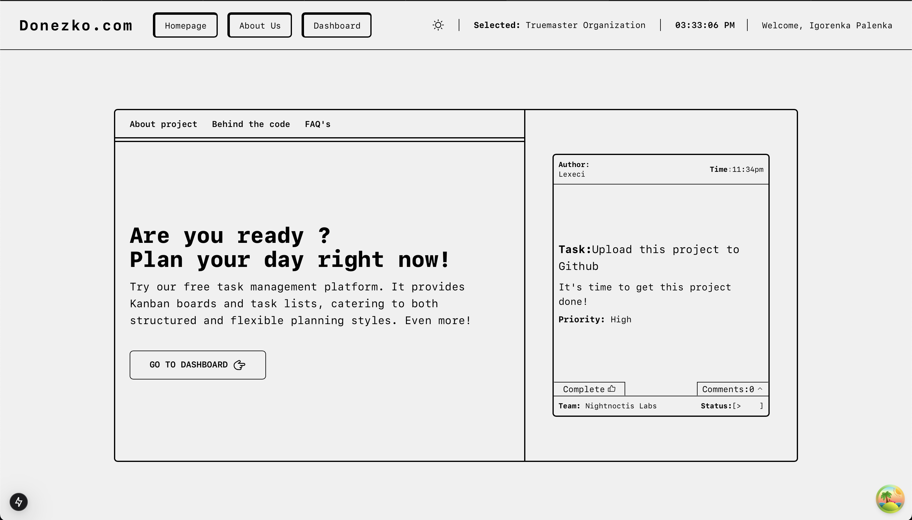

<h1 align="center">Donezko</h1>
<p align="center">
Your all-in-one platform to streamline collaboration, simplify project management, and boost team productivity
</p>

<p align="center">
  
</p>

## About Donezko

**Donezko** is a flexible and user-friendly platform designed to help organizations efficiently manage projects, teams, and users. It emphasizes scalability, customization, and ease of use to support growing teams and complex workflows.

## Table of Contents

- [About Donezko](#about-donezko)
- [Features](#features)
- [Architecture Overview](#architecture-overview)
- [Getting Started](#getting-started)
  - [Prerequisites](#prerequisites)
  - [Installation](#installation)
- [Scripts & Project Structure](#scripts--project-structure)
- [License](#license)
- [Thank You!](#thank-you)

## Features

- **User Management** 📊

  - Authentication and authorization using JWT.
  - Role-based access control for granular permissions.
  - Profile management with user statistics.

- **Project Management** 📈

  - Create, update, and delete projects.
  - Assign roles and manage user statuses within projects.
  - Transfer project management roles between users.

- **Team Management** 📝

  - Create and manage teams inside projects.
  - Assign roles and manage team members.
  - Transfer team leadership roles.

- **Organization Management** 📊

  - Manage multiple organizations and their projects.
  - Control user access and permissions at the organization level.

- **Task Management** 📝

  - Track and manage tasks associated with projects and teams.
  - Support for different task views: Kanban and list.
  - Easy moveable blocks to organize task more interactive.

- **Additional Features**

  - Pomodoro timer integration for productivity.
  - User-friendly dashboards with light and dark themes.
  - Useful time-clock with real time update.

## Architecture Overview

Donezko is a monorepo project divided into:

- **Server**  
  Backend API built with [NestJS](https://nestjs.com/), using TypeScript, Prisma ORM for database management, JWT & Passport for authentication, and Argon2 for secure password hashing.

- **Client**  
  Frontend built with [Next.js](https://nextjs.org/) and React, using TypeScript, React Query for data fetching, Tailwind CSS + Sass for styling, and Phosphor Icons for UI.

- **Types**  
  Shared TypeScript type definitions for users, projects, teams, and other entities.

## Screenshots

| Feature                 | Screenshot                                               |
| ----------------------- | -------------------------------------------------------- |
| Main page (light mode)  |      |
| Main page (dark mode)   |        |
| Dashboard               |   |
| Task page (Kanban view) |   |
| Task page (list view)   |       |
| User management         |  |
| Pomodoro timer          |    |

## Technologies Used

### Backend

- [NestJS](https://nestjs.com/)
- [Prisma](https://www.prisma.io/)
- JWT & Passport
- Argon2 (password hashing)
- Axios (HTTP client)
- Jest (testing)
- TypeScript

### Frontend

- [Next.js](https://nextjs.org/)
- React Query
- Phosphor Icons
- Tailwind CSS
- Sass
- React Hook Form
- TypeScript

## Getting Started

### Prerequisites

- Node.js (v18+ recommended)
- npm or yarn
- A compatible database (e.g., PostgreSQL, MySQL)

### Installation

1.  **Clone the repository**

    ```bash
    git clone https://github.com/lexeci/donezko.git
    cd donezko
    ```

2.  **Install dependencies**
    ```bash
    npm install &&
    cd server && npm install &&
    cd ../client && npm install &&
    cd ../
    ```
3.  **Configure environment variables**

    Copy .env.example to .env in both `/server` and `/client` folders and fill in the necessary details such as database URL, JWT secret, API keys, etc.

    ```bash
    cp server/.env.example server/.env
    cp client/.env.example client/.env
    ```

4.  **Run the development server**
    From the root folder run:
    ```bash
    npm run dev
    ```
    This concurrently starts:
    - Backend at http://localhost:3001
    - Frontend at http://localhost:3000

## Scripts & Project Structure

The project uses a monorepo structure with separate `server` and `client` directories, each with its own `package.json`.

### Root-level scripts:

- `npm run dev`  
  Runs backend and frontend concurrently in development mode.

- `npm run build`  
  Builds backend and frontend concurrently for production.

- `npm run start`  
  Runs backend and frontend concurrently in production mode.

### Server scripts (`/server/package.json`):

- `npm run start:dev`  
  Starts the NestJS server in development mode.

- `npm run start`  
  Starts the NestJS server in production mode.

- `npm run build`  
  Builds the backend code.

- `npm run lint`  
  Runs ESLint on the backend code.

- `npm run format`  
  Formats code using Prettier.

- `npm run test`  
  Runs tests using Jest.

### Client scripts (`/client/package.json`):

- `npm run dev`  
  Starts the Next.js development server.

- `npm run build`  
  Builds the frontend for production.

- `npm run start`  
  Starts the frontend in production mode.

- `npm run lint`  
  Runs ESLint on the frontend code.

All concurrent commands use [`concurrently`](https://www.npmjs.com/package/concurrently) for parallel execution.

## Thank You!

Thank you for exploring **Donezko**! We hope this solution helps you manage your projects, teams, and users efficiently.
